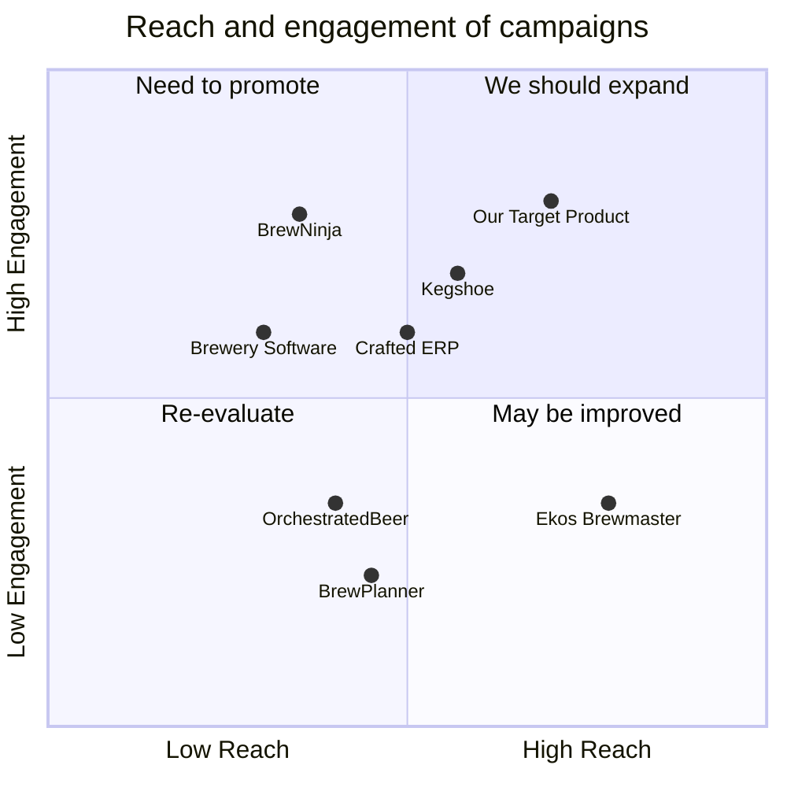

## Original Requirements
The boss has requested a user-friendly interface for a brewery production management system with a web interface. This system should include inventory management features for raw materials, finished products, and packaging materials. It should also have production planning tools to optimize schedules and improve operational performance. Sales and CRM features should be incorporated to manage customer relationships and orders. Keg and container tracking should be implemented for efficient distribution. The system should provide real-time analytics and reporting capabilities for data-driven decision-making. It should integrate seamlessly with other platforms and systems used in the brewery. The system should be cloud-based and accessible from any device. Advanced quality control mechanisms should be incorporated, such as high-quality basic instrumentation, a good sensory program, and proper methods based on industry standards. Ongoing technical support, updates, and enhancements should be offered based on user feedback and industry requirements.

## Product Goals
```python
[
    "Create a user-friendly, web-based brewery production management system",
    "Incorporate comprehensive inventory, production, sales, and CRM features",
    "Ensure seamless integration with other systems and provide ongoing support"
]
```

## User Stories
```python
[
    "As a brewery manager, I want to manage inventory of raw materials, finished products, and packaging materials so that I can prevent shortages and overstocking",
    "As a production manager, I want to use production planning tools to optimize schedules and improve operational performance",
    "As a sales manager, I want to manage customer relationships and orders through integrated CRM features",
    "As a distribution manager, I want to track kegs and containers for efficient distribution",
    "As a quality control officer, I want to use advanced quality control mechanisms to ensure the quality of our products"
]
```

## Competitive Analysis
```python
[
    "Brewery Software: Offers similar features but lacks advanced quality control mechanisms",
    "BrewPlanner: Provides production planning tools but lacks comprehensive inventory management features",
    "Kegshoe: Specializes in keg and container tracking but does not offer a comprehensive brewery management solution",
    "Ekos Brewmaster: Offers a comprehensive solution but lacks a user-friendly interface",
    "OrchestratedBeer: Offers a comprehensive solution but is not cloud-based",
    "BrewNinja: Offers a comprehensive solution but lacks seamless integration with other systems",
    "Crafted ERP: Offers a comprehensive solution but lacks ongoing technical support"
]
```

## Competitive Quadrant Chart


## Requirement Analysis
The product should be a web-based brewery production management system with a user-friendly interface. It should incorporate comprehensive inventory management, production planning, sales and CRM features. It should also provide keg and container tracking, real-time analytics and reporting capabilities, and advanced quality control mechanisms. The system should integrate seamlessly with other platforms and systems used in the brewery, be cloud-based and accessible from any device. Ongoing technical support, updates, and enhancements should be provided based on user feedback and industry requirements.

## Requirement Pool
```python
[
    ("Develop a user-friendly web interface", "P0"),
    ("Implement comprehensive inventory management features", "P0"),
    ("Incorporate production planning tools", "P0"),
    ("Integrate sales and CRM features", "P0"),
    ("Provide keg and container tracking", "P0")
]
```

## UI Design draft
The interface should be clean and intuitive, with a navigation bar at the top for quick access to different features. The inventory management feature should display a list of materials with their current quantities and a button to add or remove items. The production planning tool should display a calendar with the planned production schedule and options to add, edit, or remove production tasks. The sales and CRM feature should display a list of customers and orders, with options to add or edit customer details and manage orders. The keg and container tracking feature should display a map with the current locations of all kegs and containers, and a list of their current status.

## Anything UNCLEAR
There are no unclear points.