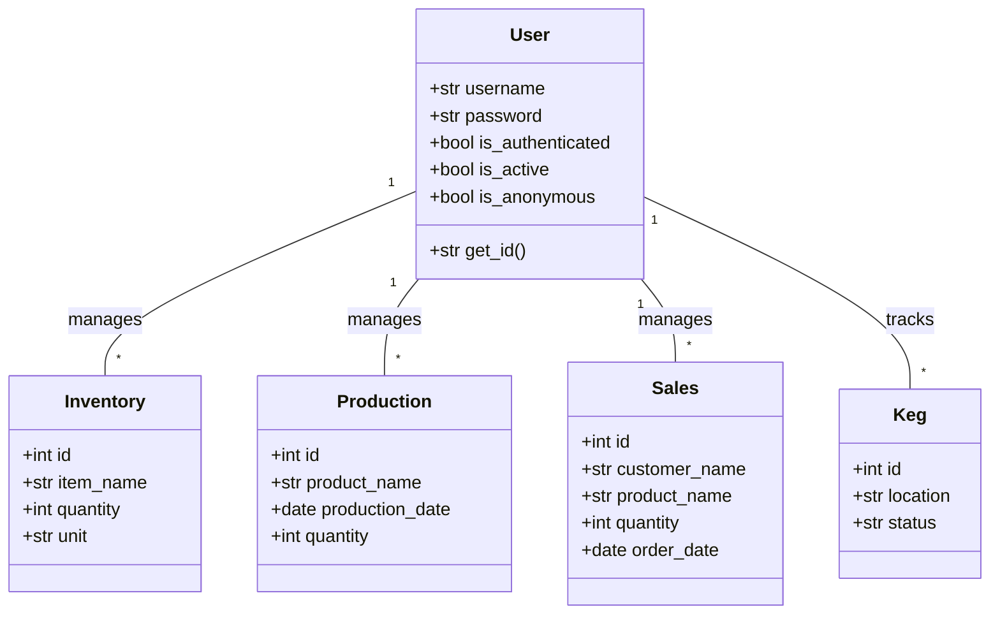
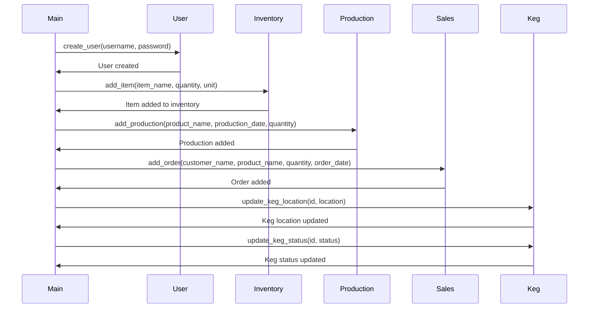

## Implementation approach
To implement this system, we will use Flask, a lightweight and flexible Python web framework. For the database, we will use SQLAlchemy ORM with PostgreSQL. We will use Flask-Admin for the admin interface and Flask-Login for user authentication. For real-time analytics and reporting, we will use the open-source Superset. For the front-end, we will use Bootstrap to ensure the system is responsive and accessible from any device. We will use Docker for containerization and deployment on a cloud platform like AWS. For quality control, we will use PyTest for testing and Black for code formatting. The system will be developed using Agile methodologies with iterative releases based on user feedback and industry requirements.

## Python package name
```python
"brewery_management_system"
```

## File list
```python
[
    "main.py",
    "config.py",
    "models.py",
    "views.py",
    "forms.py",
    "tests.py",
    "requirements.txt",
    "Dockerfile"
]
```

## Data structures and interface definitions


## Program call flow


## Anything UNCLEAR
The requirement is clear to me.